# Procesverslag
Markdown is een simpele manier om HTML te schrijven.  
Markdown cheat cheet: [Hulp bij het schrijven van Markdown](https://github.com/adam-p/markdown-here/wiki/Markdown-Cheatsheet).

Nb. De standaardstructuur en de spartaanse opmaak van de README.md zijn helemaal prima. Het gaat om de inhoud van je procesverslag. Besteedt de tijd voor pracht en praal aan je website.

Nb. Door *open* toe te voegen aan een *details* element kun je deze standaard open zetten. Fijn om dat steeds voor de relevante stuk(ken) te doen.

## Jij

  
uitwerken voor kick-off werkgroep

  ### Auteur:
  Julia Poort
  #### Je startniveau:
  Blauw

  #### Je focus:
  Responsive
 

## Je website

  
uitwerken voor kick-off werkgroep

  ### Je opdracht:
  https://www.loavies.com/nl/

  #### Screenshot(s) van de eerste pagina (small screen): 
  homepagina
  

  #### Screenshot(s) van de tweede pagina (small screen):
  detailpagina
  
 

## Toegankelijkheidstest 1/2 (week 1)

  
uitwerken na test in 2e werkgroep

  ### Bevindingen
  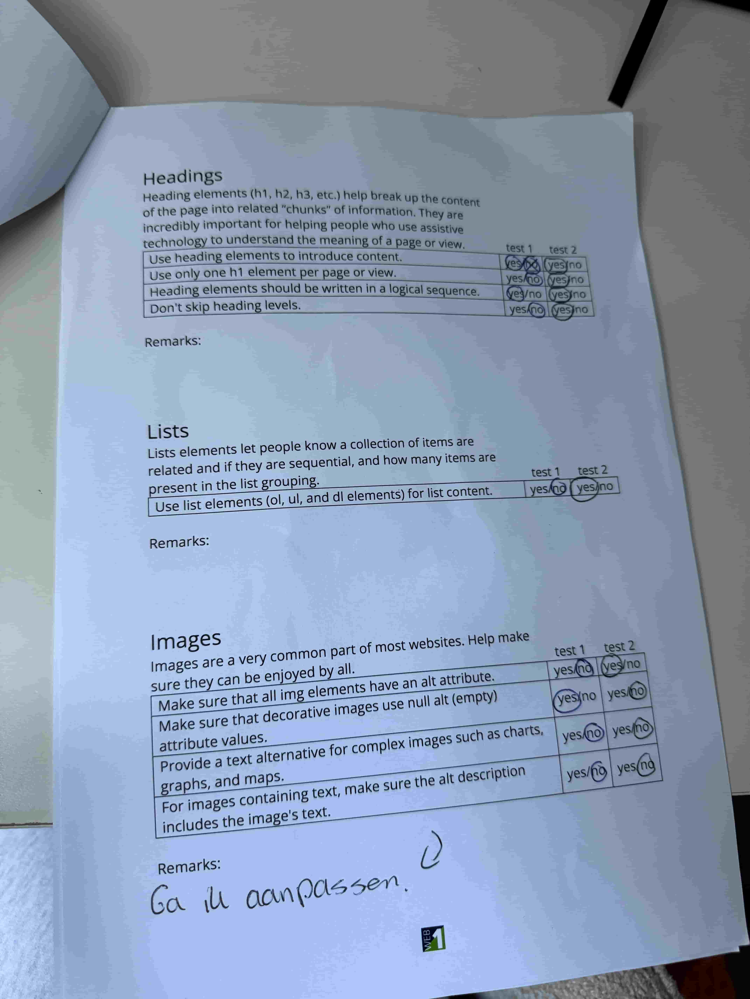
  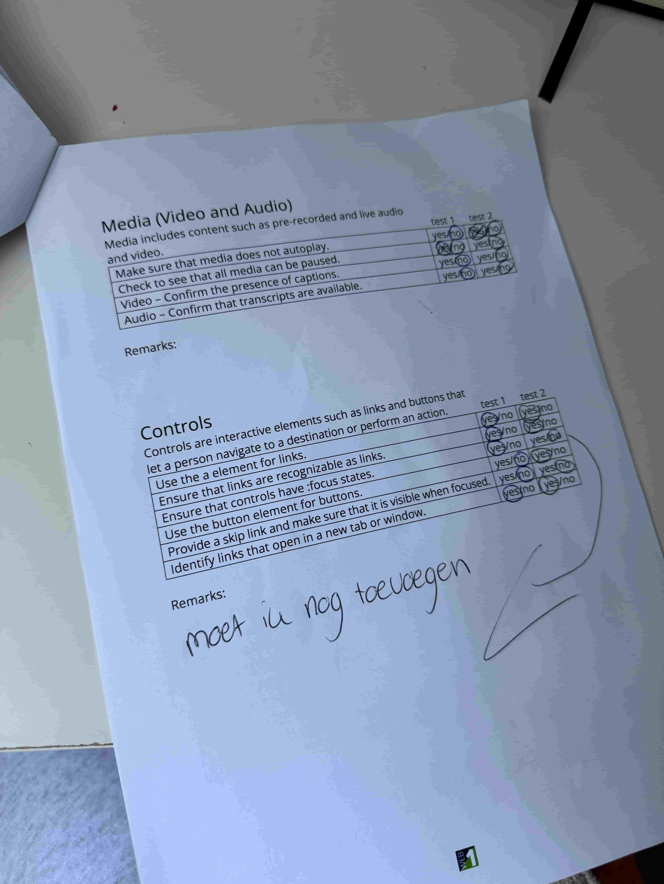
  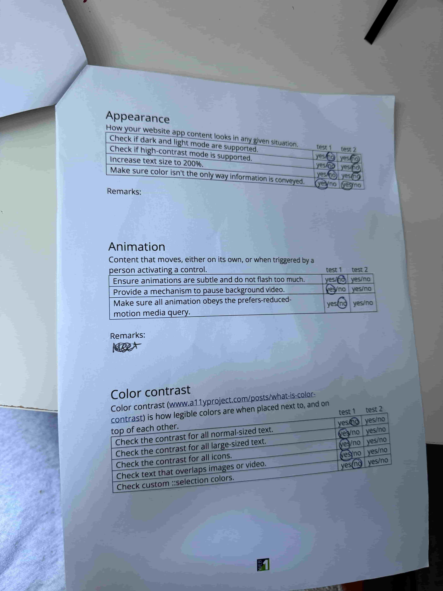
  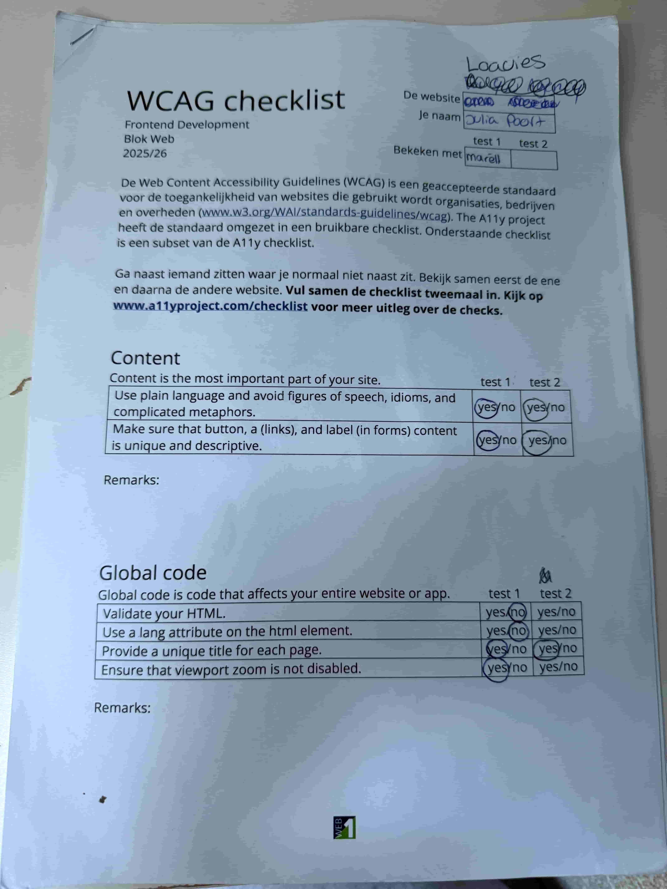
  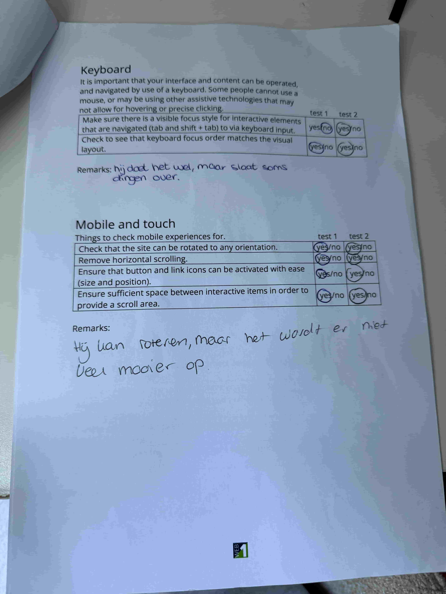

## Breakdownschets (week 1)

  
uitwerken na afloop 3e werkgroep

  ### de hele pagina: 
  
  
  

## Voortgang 1 (week 2)

  
uitwerken voor 1e voortgang

  ### Stand van zaken
  Het begon heel goed. Ik ben deze week begonnen met allebei mijn html pagina's. Het was moeilijk om niet gelijk
  te beginnen aan mijn css, maar wel beter voor mezelf. Voor html had ik vooral moeite met wat ik wel of niet als section moest doen. Voor de rest ging het vrij vlot, omdat ik mijn breakdownsschets al had gemaakt.

  
  

  Bij screenshot 1 twijfelde ik hoe ik de tekst moest indelen. Allemaal p of is de bovenste een h2? En de tekst die je over de afbeelding heen ziet staan, had ik als div. Ik wist ook niet of dit nodig was ja of nee. Het was niet nodig als divje uiteindelijk. Ik ben heel blij met de voortgangsgesprekken, want dan weet je een beetje of je goed zit ja of nee. 

  Bij screenshot 2 wist ik niet zo goed hoe ik het moest indelen qua sections. Ik heb wat hulp gevraagd en het was dus maar 1 sections en ik had er echt 4 van gemaakt. 

  ### Agenda voor meeting
  samen met je groepje opstellen

  | student 1      | student 2          | student 3    | student 4        |
  | ---            | ---                | ---          | ---              |
  | dit bespreken  | en dit             | en ik dit    | en dan ik dat    |
  | en dat ook nog | dit als er tijd is | nog een punt | dit wil ik zeker |
  | ...            | ...                | ...          | ...              |

  ### Verslag van meeting
  hier na afloop snel de uitkomsten van de meeting vastleggen

  - punt 1
  - punt 2
  - nog een punt
  - ...

## Voortgang 2 (week 3)

  
uitwerken voor 2e voortgang

  ### Stand van zaken
  Eigenlijk ging alles met vallen en opstaan. Sommige dingen gingen wel in één keer goed, zoals de afbeeldingen scrollbaar krijgen en het lettertype van loavies krijgen. Het lettertype heb ik gevonden door in de style van hun website te kijken bij het inspecteren. 

  Voor de rest was het heel veel proberen wat wel lukt en wat niet lukt. Ik heb de tekst over de afbeelding gekregen door position absolute en relative, maar bij sommige heb ik weer grid gebruikt. Ik vind grid best lastig om te begrijpen. Ik denk telkens dat ik het begrijp en dan ga ik het zelf proberen en dan doet het niet wat ik wil. Ik ga zo in het voortgangsgesprek wat uitleg vragen als daar tijd voor is. 

  Ik heb de homepagina ongeveer afgekregen. Op een paar buttons na, omdat ik er niet uitkom met grid. Ook de footer lukt niet helemaal. De detailpagina heb ik ook proberen te maken, maar dat lukt niet helemaal goed met aanspreken. Danny zei dat ik meerdere css bestanden kon aanmaken hiervoor. Maar ik vindt dat zelf heel ingewikkeld om te doen, omdat je dan ook een css bestand moet maken van stylen wat je in beide pagina's gebruikt.
  ### Agenda voor meeting
  samen met je groepje opstellen

  | student 1      | student 2          | student 3    | student 4        |
  | ---            | ---                | ---          | ---              |
  | dit bespreken  | en dit             | en ik dit    | en dan ik dat    |
  | en dat ook nog | dit als er tijd is | nog een punt | dit wil ik zeker |
  | ...            | ...                | ...          | ...              |

  ### Verslag van meeting
  hier na afloop snel de uitkomsten van de meeting vastleggen

  - punt 1
  - punt 2
  - nog een punt
- ...

## Toegankelijkheidstest 2/2 (week 4)

  
uitwerken na test in 9e werkgroep

  ### Bevindingen
  Lijst met je bevindingen die in de test naar voren kwamen (geef ook aan wat er verbeterd is):

## Voortgang 3 (week 4)

  
uitwerken voor 3e voortgang

  ### Stand van zaken
Het gaat steeds beter. Ik krijg steeds meer inzicht van hoe ik dingen moet oplossen en hoe ik dingen zou moeten stylen. Ik heb het nu grotendeels af. Voor iphone scherm is mijn website helemaal klaar. Ik mis alleen nog een paar dingen voor de responsive. Ook moet ik nog aan de slag met javascript. Ik wil sowieso mijn menu knop laten werken, want dat is wel een belangrijke voor mijn website. Ik heb het zelf al een beetje geprobeerd met de oefening uit de les ernaast. Ik kom er niet helemaal uit, omdat ik moeite heb met het aanspreken van de button en het gebruik van javascript. Javascript is tot nu toe niet mijn sterkste punt. Ik wil dit daarom graag in de les gaan vragen.

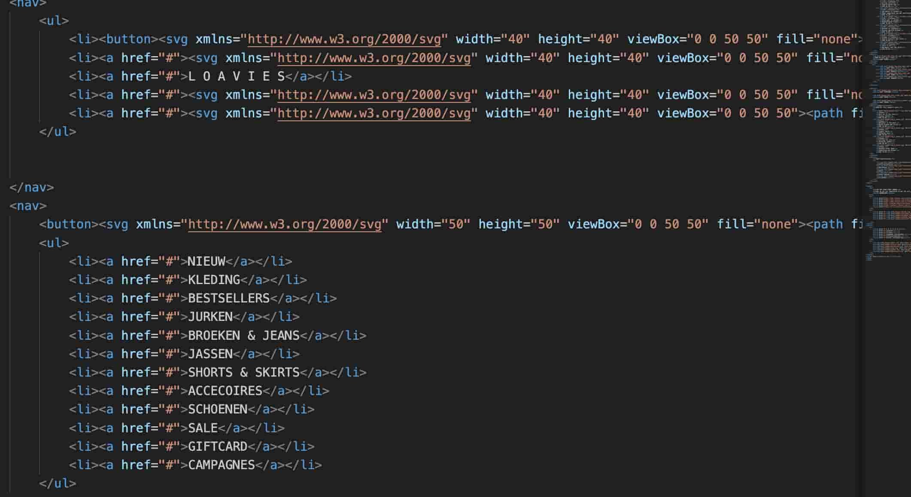
In dit screenshot zie je dat ik twee navigatie's heb gebruikt om mijn navigatie te stylen. Ik wist niet dat dit mocht, maar gelukkig wel. Dit heb ik ook bij mijn footer gedaan om hem te stylen.
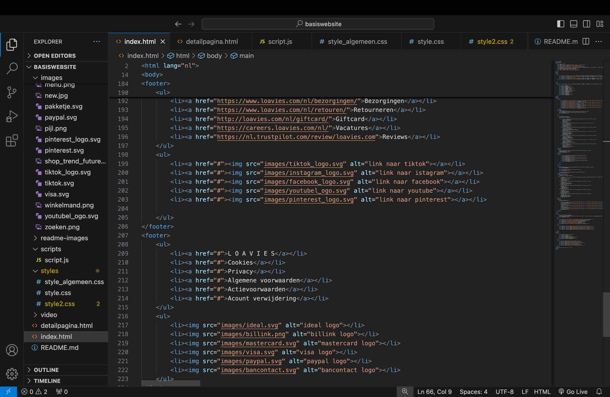

Het hamburger menu is gelukt! Ik heb de styling van het uitgeklapte menu niet helemaal nagemaakt. Dit wil ik voor het laatst bewaren als ik nog tijd over heb. Ik moet namelijk nog veel aan de detailpagina doen. Ook een paar javascript dingetjes. Ik hoef er eigenlijk maar 1, omdat ik responsive heb gekozen. Toch ga ik proberen het helemaal na te maken. 
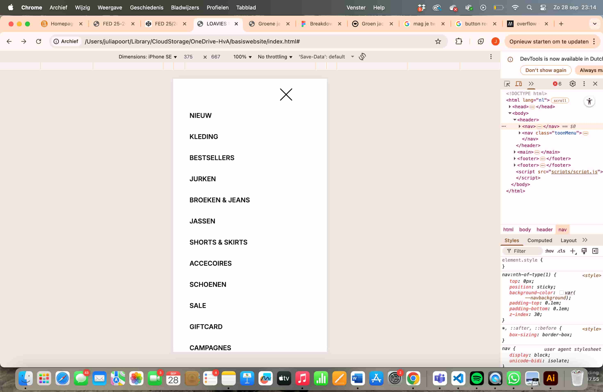

Ik heb mijn code ook alvast door de validator gehaald. Ik schrok een beetje want ik had 54 errors.... Gelukkig viel het allemaal mee en kwamen de meeste error doordat ik spaties had gebruikt in mijn afbeelding namen. Dit heb ik allemaal gelijk aangepast. Ook had ik op sommige plekken dubbele tags gebruikt. Dit heb ik allemaal gelijk weggehaald. Nu kan ik weer met een schone lei verdergaan. 

  ### Agenda voor meeting
  samen met je groepje opstellen

  | student 1      | student 2          | student 3    | student 4        |
  | ---            | ---                | ---          | ---              |
  | dit bespreken  | en dit             | en ik dit    | en dan ik dat    |
  | en dat ook nog | dit als er tijd is | nog een punt | dit wil ik zeker |
  | ...            | ...                | ...          | ...              |

  ### Verslag van meeting
  hier na afloop snel de uitkomsten van de meeting vastleggen

  - punt 1
  - punt 2
  - nog een punt
  - ...

## Eindgesprek (week 5)

  
uitwerken voor eindgesprek

  ### Je uitkomst - karakteristiek screenshots:
  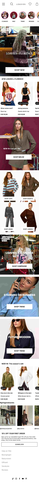
  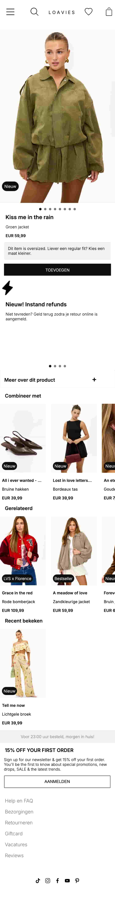

  ### Dit ging goed/Heb ik geleerd: 
  De homepagina is bij mij wel goed gegaan. Ik bleef heel lang hangen bij de video van Florence. Achteraf super zonde, want deze tijd kon ik super goed gebruiken voor mijn detailpagina. Voor de rest ging eigenlijk alles wel soepel. Ik heb echt zoveel geleerd de afgelopen weken. nth-of-type had ik nog nooit gebruikt. Ik vind het echt een superfijne manier om dingen aan te spreken. Scheelt heel veel classes en sections. Ook heb ik superveel geleerd over dingen positioneren: tekst over een afbeelding plaatsen, tekst naast een afbeelding plaatsen, knoppen over een afbeelding plaatsen en ook een video toevoegen had ik nog nooit gedaan. Grid vond ik eerst moeilijk om te begrijpe, maar ook dat heb ik nu goed onder de knie. 

  Waar ik het meest blij mee ben is dat ik responsive heb leren coderen. Ik vroeg me dit me al af of het moeilijk zou zijn. Ik vond dit super erg meevallen. Het is soms even een beetje spelen met de styling weer, maar prima te doen. Hier ga ik zeker wat aan hebben. 

  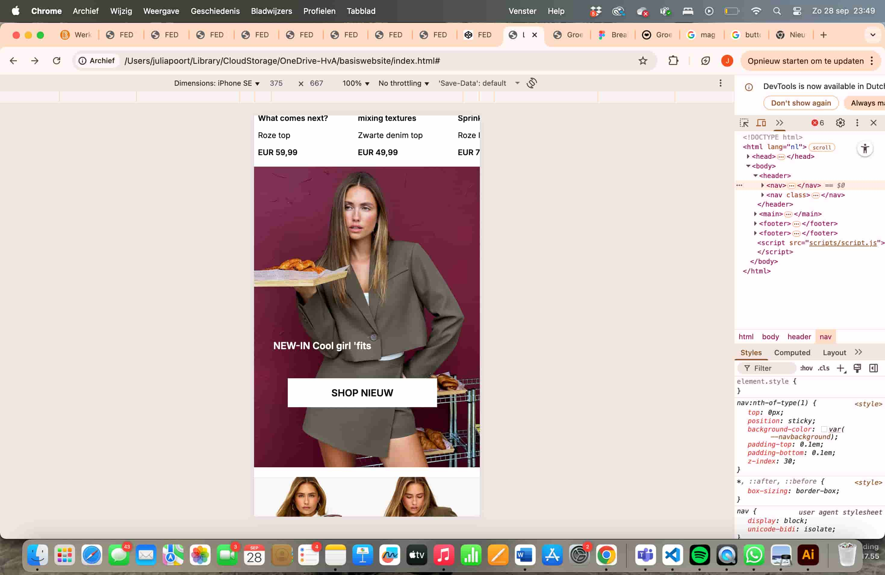
  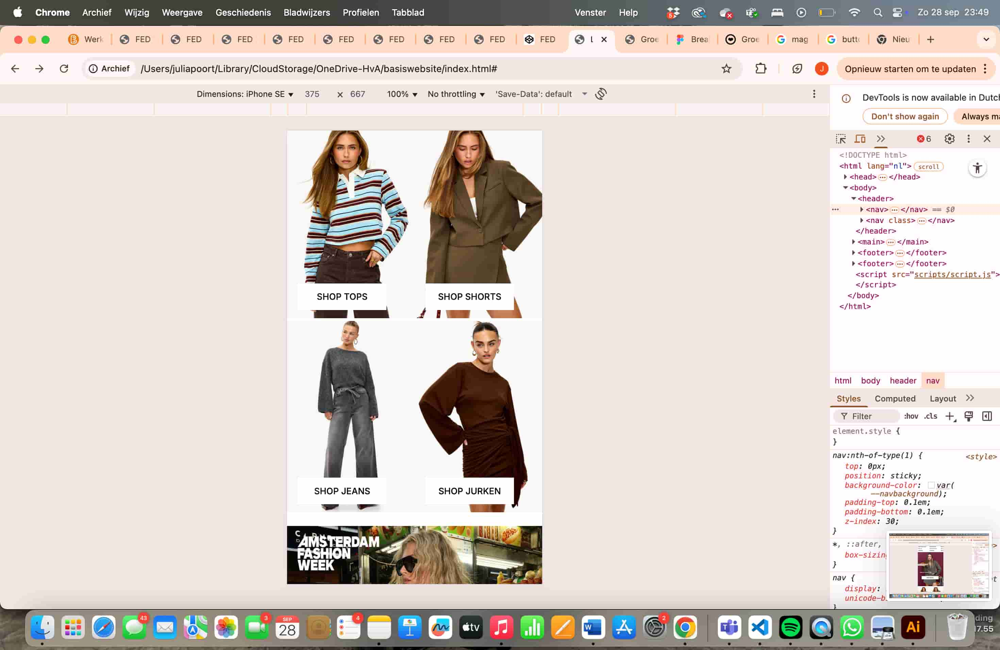

  ### Dit was lastig/Is niet gelukt:
Ik merk dat ik moeite heb met dingen aanspreken. Ik merk dat ik best wel inzicht heb gekregen met hoe ik dingen moet gaan stylen, maar ik loop dan vaak af met het aanspreken van dingen. In de loop van de tijd ging het wel steeds beter, maar ik merk dat hierin verbeterpunten zijn. Het is me uiteindelijk niet gelukt om alles helemaal responsive te maken. Telefoonscherm lijkt voor 99% op de website van Loavies. Laptop daarintegen denk ik 80-85%. Ik heb net te weinig tijd gehad om de puntjes op de i te zetten. Ik had graag gewild dat ik de tekst kon uitklappen en dat de hartjes werken. Ook horen de plaatjes eigenlijk eerst te scrollen en daarna pas de rest van de pagina. Hier heb ik ook helaas geen tijd meer voor gehad. Ik baal ook heel erg dat de navigatie op groot scherm niet helemaal lukt. Eigenlijk moeten de icoontjes naar links en rechts verplaatsen, maar dat lukte me niet. Ik heb het ook nog aan de studentassistent gevraag, maar zei wist ook niet hoe we dit moesten oplossen. Het was helaas te laat om dit nog aan Danny te vragen. Als ik één week extra had gehad was het me gelukt. Ik ben wel heel trots op mezelf op hoe ver ik ben gekomen. Het was aan het begin weer heel erg inkomen met coderen. Gelukkig vind ik het wel leuk en interessant om te leren. 
  
  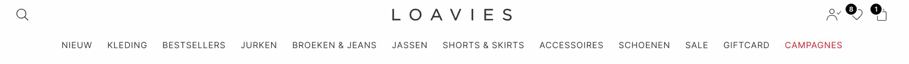

### Herkansing:
Dit heb ik veranderd:
-Mijn tweede pagina beter responsive maken
-Mijn navigatie beter responsive maken
-Dubbele css samengevoegd
-Ga terug knop toegevoegd
-Dubbele plaatjes uit github verwijderen 
-Van sommige pixels em of procent gemaakt
-Grid op de productpagina gezet

Als eerst ben ik aan de slag gegaan met de navigatie beter responsive maken. Ik had namelijk verwacht dat dat het meeste werk zou zijn. Dit viel achteraf eigenlijk best mee. Ik heb hulp aan chat gpt gevraagd en uiteindelijk hoefde ik helemaal geen divjes te gebruike of een een tweede navigatie te maken. Door de justify-content space between die ik in de navigatie nodig heb op mijn telefoonscherm blijft de ruimte tussen de navigate, waardoor het moeilijk werd om deze op groter scherm naar elkaar te schuiven. Toch is het me gelukt door met media query justify-content center te gebruiken. Dit zorgde ervoor dat alle content in het midden kwam. Nu kan ik de list items los positioneren zonder divs te gebruiken. Ik heb gebruik gemaakt van: li:nth-child(2){ margin-right: auto;} en li:nth-child(4){ margin-right: auto;} om de list items op de goede plek te krijgen. 

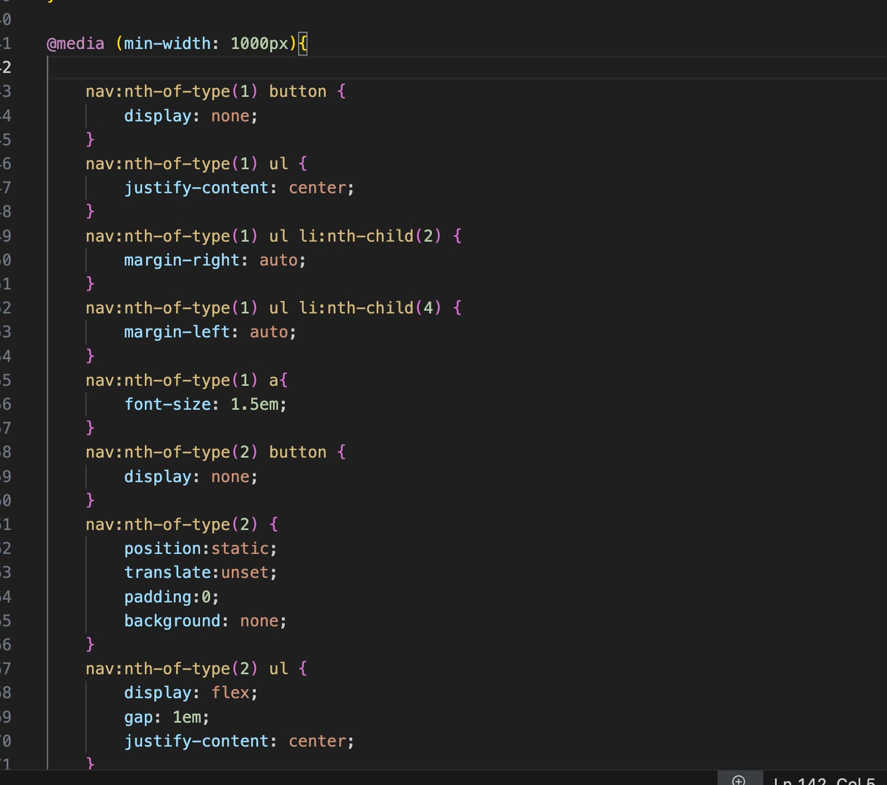

Om de tweede pagina beter responsive te maken is het me gelukt om het caroussel te maken. Hierbij had ik eerst wat moeite met het aanspreken ervan, maar is mij uiteindelijk gelukt. Het is helaas niet meer gelukt om het automatisch te laten scrollen door javascript. 
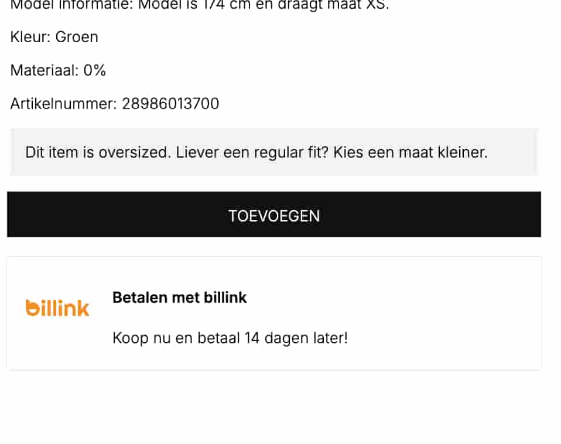

De tekst met informatie over de items moest eigenlijk uitklapbaar worden gemaakt. Dit was mij soort van gelukt. De helft moest zichtbaar zijn en als je dan op lees verder klikt, moet je de rest te zien krijgen. Ik heb heel veel geprobeerd, maar kreeg het toch niet helemaal voor elkaar. Ik heb er uiteindelijk voor gekozen om de tekst gewoon helemaal in beeld te laten. 

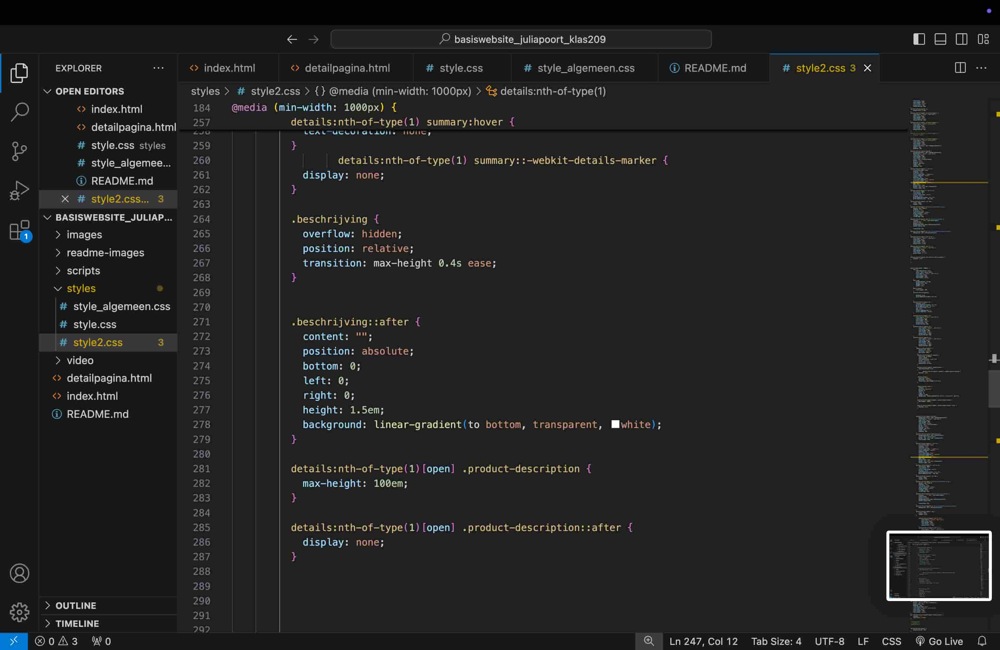

## Bronnenlijst

  
continu bijhouden terwijl je werkt

  Nb. Wees specifiek ('css-tricks' als bron is bijv. niet specifiek genoeg). 
  Nb. ChatGpT en andere AI horen er ook bij.
  Nb. Vermeld de bronnen ook in je code.

  1. Danny
  2. Studentassistenten
  3. Chatgpt heb ik gebruikt voor kleine dingen, zoals het positioneren van buttons als dat niet werkte. Of screenshots van mijn code en mijn website met de vraag waarom het niet werkt. 
  4. Oefening codepen: https://dlo.mijnhva.nl/content/enforced/702741-FDMCI-CRS-00045462/FED%2025-26%20-%20Blok%201%20-%20Oefening%20JS%203-stap%20-%202%20Hamburger%20menu.pdf 
  5. Oefening codepen: https://dlo.mijnhva.nl/content/enforced/702741-FDMCI-CRS-00045462/FED%2025-26%20-%20Blok%201%20-%20Oefening%20flexbox%20-%201%20flexen%20maar.pdf
  6. Oefening codepen: https://dlo.mijnhva.nl/content/enforced/702741-FDMCI-CRS-00045462/FED%2025-26%20-%20Blok%201%20-%20Oefening%20flexbox%20-%204%20carousel.pdf
  7. Oefening codepen: https://dlo.mijnhva.nl/content/enforced/702741-FDMCI-CRS-00045462/FED%2025-26%20-%20Blok%201%20-%20Oefening%20flexbox%20-%203%20flexy%20header.pdf
  8. Oefening codepen: https://dlo.mijnhva.nl/content/enforced/702741-FDMCI-CRS-00045462/FED%2025-26%20-%20Blok%201%20-%20Oefening%20grid%20-%201%20vingers%20warmen.pdf
  9. Oefening codepen: https://dlo.mijnhva.nl/content/enforced/702741-FDMCI-CRS-00045462/FED%2025-26%20-%20Blok%201%20-%20Oefening%20positioneren%20-%201%20Zet%20dingen%20op%20plekken.pdf
  10. MDN heb ik gebruikt voor kleine vraagjes, zoals deze: https://developer.mozilla.org/en-US/docs/Web/CSS/overflow Ik had als idee om overflow te gebruiken. Ik zoek dan hier even op welke ik dan het best zou kunnen gebruiken. Deze website is superfijn, omdat je er dan een voorbeeldje bij krijgt. 
  11. Ook heb ik veel samen gewerkt met klasgenoten. We gingen dan in de studieruimte zitten en hielpen elkaar een beetje. Dit was echt super.

